> **Record PC tutorials with your own face, no webcam needed.**
> CamLink turns your Android phone into a wireless webcam + microphone for a PC screen recorder, over your own Wi-Fi.

**Created by [MD Saiful Islam Tamim](https://github.com/tamimwork)** &nbsp;|&nbsp; Android (Kotlin) &nbsp;|&nbsp; Electron (PC) &nbsp;|&nbsp; WebRTC

---

## ✨ What is CamLink?

Many creators want to make **PC tutorials**, but they have **no webcam and no microphone**. A plain screen recording shows the screen, but never *your face*.

**CamLink fixes that.** Open the recorder on your PC, scan a QR code with your phone, and the phone becomes a **wireless webcam + mic**. The recorder places your face as a **movable bubble on top of your screen** and saves everything in **one video file**.

Think of it as *Loom + DroidCam*, built for tutorial makers. It runs fully on your own **Wi-Fi**: no cloud, no account, no internet needed.

---

## ⬇️ Download

Get the latest builds from the **[Releases](../../releases/latest)** page:

| Platform | File |
|---|---|
| 📱 Android | `CamLink-Android-*.apk` (allow *Install unknown apps*) |
| 💻 Windows | `CamLink-Recorder-Setup-*.exe` (installer) or `CamLink-Recorder-Portable-*.exe` |

> Windows SmartScreen may warn because the app is not code-signed. Click **More info, then Run anyway**.

---

## 🧭 How it works



---

## 📱 Android App

| | Feature | Details |
|---|---|---|
| 📷 | **Wireless webcam** | Live camera streaming, switch **front / back** camera without reconnecting |
| 🎤 | **Wireless microphone** | Echo cancellation, noise suppression, auto gain, mute / unmute |
| 🔳 | **QR pairing** | Fast ML Kit QR scanner with flashlight, plus **manual IP entry** as a fallback |
| 🔍 | **Camera controls** | Zoom **1x to 5x**, torch, autofocus lock, exposure + white balance lock |
| 🎞️ | **Quality settings** | **720p / 1080p** and **30 / 60 FPS**, mirror / flip preview, pause video |
| 🔄 | **Wi-Fi auto recovery** | If Wi-Fi drops, CamLink reconnects and resumes the stream by itself |
| ⚡ | **1-tap reconnect** | Remembers your last PC, you only enter the pairing code |
| 📡 | **Connection test** | Latency, jitter, bitrate, 2.4 / 5 GHz detection and a quality rating |
| 🔋 | **Battery + heat guard** | Warnings when the battery is low or the phone gets hot |
| 🛡️ | **Background streaming** | Foreground service keeps camera + mic alive with the screen off |
| 🎨 | **Studio UI** | Navy + cyan theme, pulsing **LIVE** badge, session timer, animated onboarding |
| 🌗 | **Dark + light theme** | Switch in Settings, or follow the phone's system theme |

## 💻 PC Recorder

| | Feature | Details |
|---|---|---|
| 🔐 | **Secure local pairing** | Built-in secure WebSocket server (`wss`, self-signed) + QR code + 6-digit code |
| 🖥️ | **Screen / window picker** | Choose any screen or window with live thumbnails |
| 🙂 | **Face bubble** | **Drag** it anywhere, **resize** it, choose **circle / rounded / rectangle**, border color, mirror |
| 🔊 | **Audio mixer** | Phone mic + optional PC system sound, level meters, mute and volume per source |
| 🔴 | **Recording** | **Pause / resume**, 3-2-1 countdown, timer, **WebM** or **MP4** export |
| 💾 | **Safe for long videos** | Recording is written to disk while you record, so long tutorials do not eat your RAM |
| ⌨️ | **Global hotkeys** | `Ctrl + Shift + R` start / stop, `Ctrl + Shift + P` pause / resume |
| 📊 | **Live diagnostics** | Latency, incoming resolution and FPS |
| 🌗 | **Dark + light theme** | One-click toggle in the sidebar, follows Windows by default |

---

## 🛠️ Tech Stack



---

## 📂 Project Structure

```text
camlink/
├── app/                    Android app (Kotlin + Jetpack Compose)
├── camlink-recorder/       PC app (Electron)
│   ├── main.js             window, hotkeys, recording to disk
│   ├── server.js           secure WebSocket signaling server
│   └── renderer/           UI, compositor, audio mixer, recorder
├── docs/                   README graphics
├── .github/workflows/      GitHub Actions: APK build + release (APK and .exe)
└── README.md
```

---

## 🚀 Getting Started

### 1️⃣ Get the Android app (APK via GitHub Actions)

1. Push this repository to your GitHub account.
2. Open the **Actions** tab. The **Build CamLink APK** workflow starts automatically (or click **Run workflow**).
3. When it finishes, open the run, go to **Artifacts**, and download **`CamLink-debug-apk`**.
4. Unzip it and install the `.apk` on your phone (allow *Install unknown apps* if asked).

### 2️⃣ Run the PC recorder

Requirements: [Node.js](https://nodejs.org) 18 or newer, Windows 10 / 11.

```bash
cd camlink-recorder
npm install
npm start
```

> 🧱 **Windows Firewall:** the first time, click **Allow access** so your phone can reach port `8443`.

### 3️⃣ Connect and record

1. Make sure the **phone and PC are on the same Wi-Fi**.
2. On the PC you will see the **QR code**. On the phone, tap **Scan QR** and point the camera at it.
3. Your face appears on the PC. Pick your **screen**, place the **face bubble**, and press **Record** 🔴.
4. Press stop, choose where to save, done! 🎉

### 📦 Build a Windows installer (optional)

```bash
cd camlink-recorder
npm run dist
```

### 🚀 Publish a new release (APK + .exe automatically)

```bash
git tag v1.0.0
git push origin v1.0.0
```

GitHub Actions builds the APK and the Windows installer, then publishes both on the **Releases** page.

---

## 🩺 Troubleshooting

| Problem | Fix |
|---|---|
| 📵 Phone cannot connect | Same Wi-Fi? Allow the app in **Windows Firewall** (port `8443`). Some routers block device-to-device traffic (**AP isolation**), turn it off |
| 🔒 Wrong code error | Use the **current** 6-digit code. Press **New code** on the PC if needed |
| 🧊 Video freezes on the phone | Keep the phone cool and charged, and try **720p / 30 FPS** |
| 🔇 No system sound recorded | System audio capture works on **Windows**. Enable it in the audio panel |

---

## 🗺️ Roadmap

- [ ] 🍎 macOS / 🐧 Linux support for the recorder
- [ ] 🧼 Background blur and beauty filters for the face cam
- [ ] 🔌 USB connection mode for ultra low latency
- [ ] 🍏 iPhone app
- [ ] 🎨 More face-bubble themes and layouts

---

## 👨‍💻 Author


## 📄 License

Released under the **MIT License**. Free to use, learn from and improve.

---


